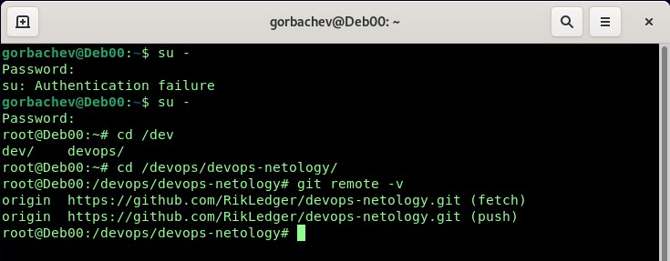
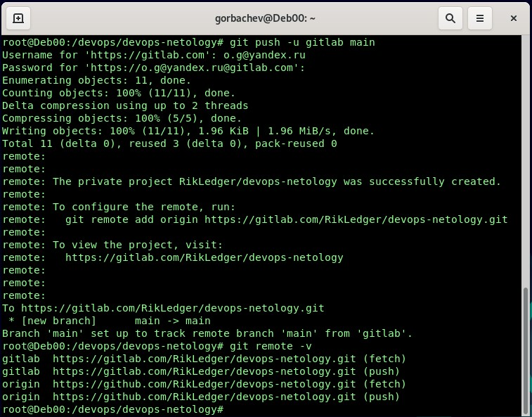
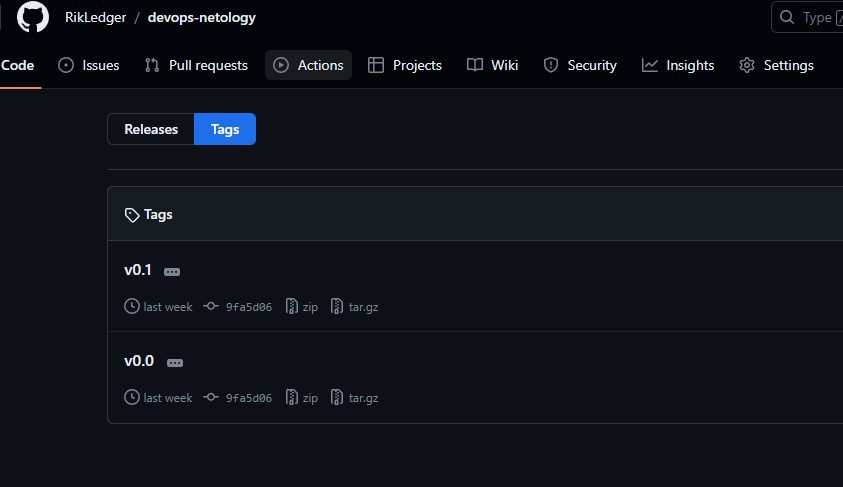
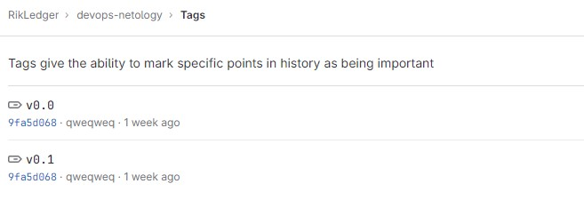
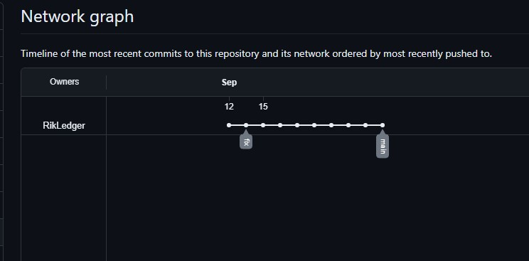
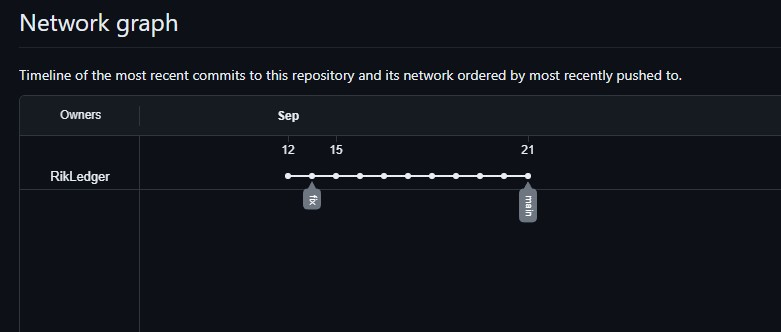
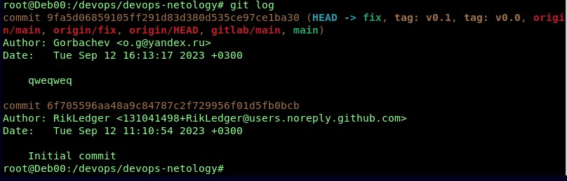

# Домашнее задание к занятию «Основы Git» - `Горбачев Олег`


## Задание 1. Знакомимся с GitLab 

Из-за сложности доступа к Bitbucket в работе достаточно использовать два репозитория: GitHub и GitLab.

Иногда при работе с Git-репозиториями надо настроить свой локальный репозиторий так, чтобы можно было 
отправлять и принимать изменения из нескольких удалённых репозиториев. 

Это может понадобиться при работе над проектом с открытым исходным кодом, если автор проекта не даёт права на запись в основной репозиторий.

Также некоторые распределённые команды используют такой принцип работы, когда каждый разработчик имеет свой репозиторий, а в основной репозиторий пушатся только конечные результаты 
работы над задачами. 

### GitLab

Создадим аккаунт в GitLab, если у вас его ещё нет:

1.1. GitLab. Для [регистрации](https://gitlab.com/users/sign_up)  можно использовать аккаунт Google, GitHub и другие. 
1.2. После регистрации или авторизации в GitLab создайте новый проект, нажав на ссылку `Create a projet`. 
Желательно назвать также, как и в GitHub — `devops-netology` и `visibility level`, выбрать `Public`.
1.3. Галочку `Initialize repository with a README` лучше не ставить, чтобы не пришлось разрешать конфликты.
1.4. Если вы зарегистрировались при помощи аккаунта в другой системе и не указали пароль, то увидите сообщение:
`You won't be able to pull or push project code via HTTPS until you set a password on your account`. 
Тогда перейдите [по ссылке](https://gitlab.com/profile/password/edit) из этого сообщения и задайте пароль. 
Если вы уже умеете пользоваться SSH-ключами, то воспользуйтесь этой возможностью (подробнее про SSH мы поговорим в следующем учебном блоке).
1.5. Перейдите на страницу созданного вами репозитория, URL будет примерно такой:
https://gitlab.com/YOUR_LOGIN/devops-netology. Изучите предлагаемые варианты для начала работы в репозитории в секции
`Command line instructions`. 
1.6. Запомните вывод команды `git remote -v`.


   
1.7. Из-за того, что это будет наш дополнительный репозиторий, ни один вариант из перечисленных в инструкции (на странице 
вновь созданного репозитория) нам не подходит. Поэтому добавляем этот репозиторий, как дополнительный `remote`, к созданному
репозиторию в рамках предыдущего домашнего задания:
`git remote add gitlab https://gitlab.com/YOUR_LOGIN/devops-netology.git`.
1.8. Отправьте изменения в новый удалённый репозиторий `git push -u gitlab main`.
1.9. Обратите внимание, как изменился результат работы команды `git remote -v`.
   


#### Как изменить видимость репозитория в  GitLab — сделать его публичным 

* На верхней панели выберите «Меню» -> «Проекты» и найдите свой проект.
* На левой боковой панели выберите «Настройки» -> «Основные».
* Разверните раздел «Видимость» -> «Функции проекта» -> «Разрешения».
* Измените видимость проекта на Public.
* Нажмите «Сохранить изменения».

## Задание 2. Теги

Представьте ситуацию, когда в коде была обнаружена ошибка — надо вернуться на предыдущую версию кода,
исправить её и выложить исправленный код в продакшн. Мы никуда не будем выкладывать код, но пометим некоторые коммиты тегами и создадим от них ветки. 

2.1. Создайте легковестный тег `v0.0` на HEAD-коммите и запуште его во все три добавленных на предыдущем этапе `upstream`.
```shell
git tag v0.0 
git push origin v0.0 
git push gitlab v0.0 
```
2.2. Аналогично создайте аннотированный тег `v0.1`.
```shell
git tag v0.1 
git push origin v0.1 
git push gitlab v0.1 
```
   
2.3. Перейдите на страницу просмотра тегов в GitHab (и в других репозиториях) и посмотрите, чем отличаются созданные теги. 
    * в GitHub — https://github.com/RikLedger/devops-netology/releases;

    * в GitLab — https://gitlab.com/RikLedger/devops-netology/-/tags;

  
## Задание 3. Ветки 

Давайте посмотрим, как будет выглядеть история коммитов при создании веток. 

3.1. Переключитесь обратно на ветку `main`, которая должна быть связана с веткой `main` репозитория на `github`.
```shell
git checkout origin/main
```
3.2. Посмотрите лог коммитов и найдите хеш коммита с названием `Prepare to delete and move`, который был создан в пределах предыдущего домашнего задания.
```shell
git log --oneline
```    
3.3. Выполните `git checkout` по хешу найденного коммита. 
3.4. Создайте новую ветку `fix`, базируясь на этом коммите `git switch -c fix`.
3.5. Отправьте новую ветку в репозиторий на GitHub `git push -u origin fix`.
3.6. Посмотрите, как визуально выглядит ваша схема коммитов: https://github.com/YOUR_ACCOUNT/devops-netology/network.

 

3.7. Теперь измените содержание файла `README.md`, добавив новую строчку.
3.8. Отправьте изменения в репозиторий и посмотрите, как изменится схема на странице https://github.com/YOUR_ACCOUNT/devops-netology/network
 
 

и как изменится вывод команды `git log`.

 

## Задание 4. Упрощаем себе жизнь

Попробуем поработь с Git при помощи визуального редактора. 

1. В используемой IDE PyCharm откройте визуальный редактор работы с Git, находящийся в меню View -> Tool Windows -> Git.
2. Измените какой-нибудь файл, и он сразу появится на вкладке `Local Changes`, отсюда можно выполнить коммит, нажав на кнопку внизу этого диалога. 
3. Попробуйте выполнить пару коммитов, используя IDE. 

[По ссылке](https://www.jetbrains.com/help/pycharm/commit-and-push-changes.html) можно найти справочную информацию по визуальному интерфейсу. 

Если вверху экрана выбрать свою операционную систему, можно посмотреть горячие клавиши для работы с Git. 
Подробней о визуальном интерфейсе мы расскажем на одной из следующих лекций.

--- 

*Да, программа удобная, в процессе обучения посмотрю ее поподробней*

В качестве результата работы по всем заданиям прилоагаю ссылки на репозитории в github, gitlab.  

Прилагаю:

#### *https://github.com/RikLedger/devops-netology.git*
#### *https://gitlab.com/RikLedger/devops-netology.git*
 
